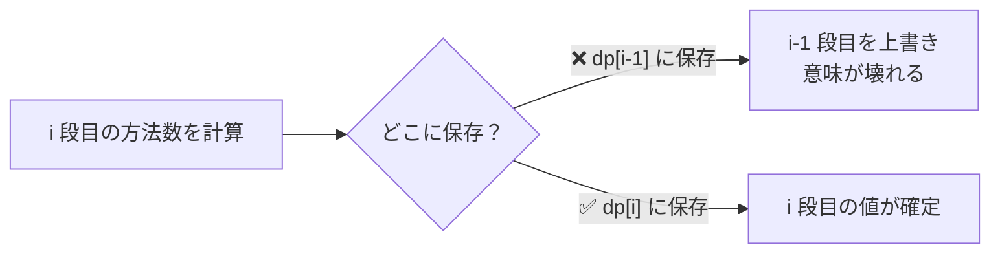
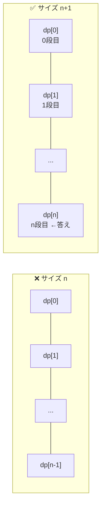
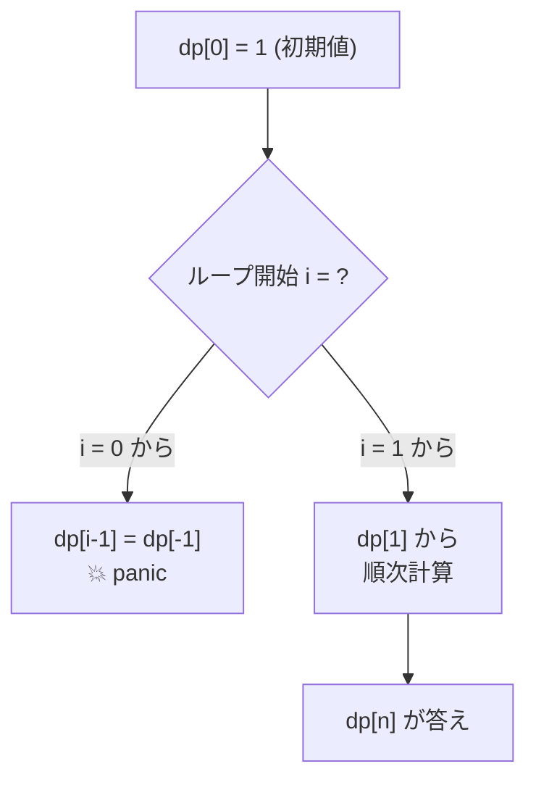
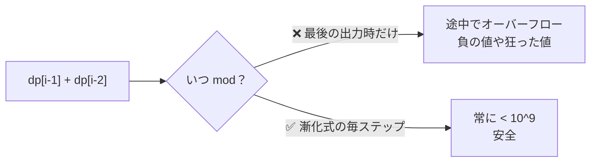
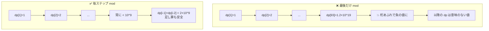
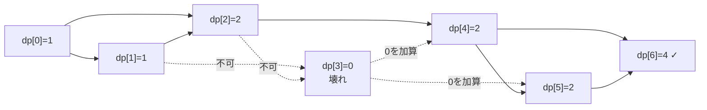
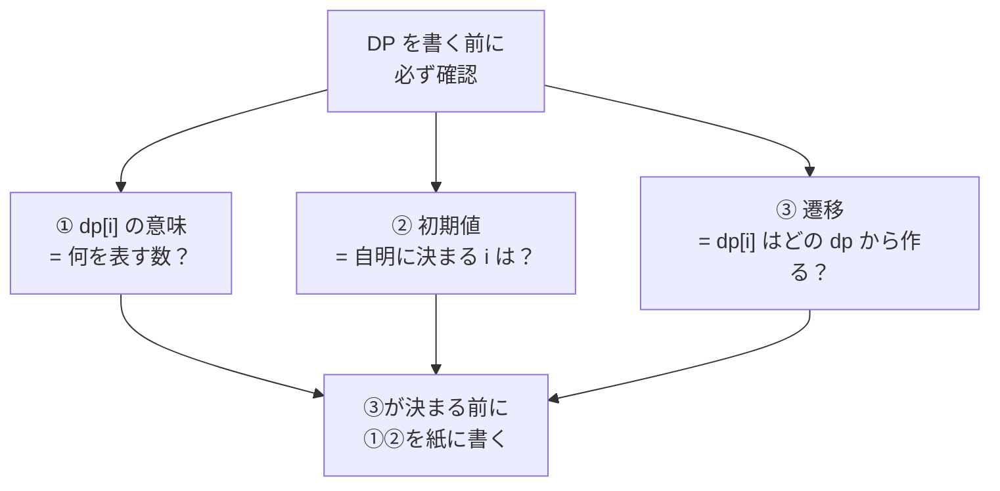

# ABC129 C - Typical Stairs 学び

## 問題

0 段目からスタートし、1 段か 2 段ずつ上がって N 段目に到達する場合の数を求める。M 個の壊れ階段は踏めない。答えは mod 1,000,000,007。

---

## ハマったポイント 4 つ

### 1. dp の更新先がズレていた（致命的）

ループで「i 段目に到達する方法」を計算しているのに、書き込み先が `dp[i-1]` になっていた。

**教訓**: 「何を計算しているか」と「書き込む添字」を声に出して一致させる。

---

### 2. dp 配列のサイズと最終出力

0 段目〜N 段目まで欲しいので要素は **N+1 個** 必要。`dp[N]` を出力する。

**教訓**: 「dp[k] = k 段目への到達数」と意味を固定すれば、自然と長さは N+1 になる。

---

### 3. ループの開始位置

`dp[0] = 1` は初期値として確定済み。ループで再計算する必要がない。i=0 から回すと `dp[i-1]` が `dp[-1]` になり Go ではパニック。

**教訓**: 初期値で確定済みのインデックスはループから外す。境界条件を if で逃げるより、ループ範囲そのものを正しく取る方が綺麗。

---

### 4. mod を取るタイミング

N ≤ 10^5 でフィボナッチ的に増加 → 桁数 ~ 約 21,000 桁 → int64 でも余裕で溢れる。

#### なぜそんなに早く溢れるのか

壊れ階段がない場合、`dp[i] = dp[i-1] + dp[i-2]` はフィボナッチ数列そのもの。
フィボナッチは指数関数的に増えるので、`F(n) ≈ φ^n / √5`（φ ≈ 1.618）。

| n | F(n) の概算 | 桁数 | int64 (約 9.22×10^18) との比較 |
|---|---|---|---|
| 30 | 約 1.3×10^6 | 7 桁 | 余裕 |
| 60 | 約 1.5×10^12 | 13 桁 | 余裕 |
| 90 | 約 1.8×10^18 | 19 桁 | ギリギリ |
| **93** | **約 1.2×10^19** | **20 桁** | **💥 int64 を超える** |
| 1,000 | 約 4.3×10^208 | 209 桁 | 桁違いに溢れる |
| 100,000 | — | 約 20,898 桁 | 言うまでもない |

**つまり N=93 程度で既に int64 を超えてしまう**。N=10^5 まで耐える整数型はそもそも存在しない（多倍長整数を使わない限り）。

#### mod を毎ステップ取ると何が起きる？

mod 1,000,000,007 を毎回適用すると、各 `dp[i] < 10^9` が保たれる。
だから次の足し算は最大でも `dp[i-1] + dp[i-2] < 2 × 10^9 ≈ 2^31`。
これは int64（最大 ≈ 9.22×10^18）に余裕で収まる。

#### 同値性のキモ

「足し算してから mod」と「mod してから足し算」は結果が一致する：

`(a + b) mod M = ((a mod M) + (b mod M)) mod M`

この性質があるから、毎ステップ mod を取っても答えは変わらない。**むしろ取らないと正しく計算できない**。

**教訓**: 漸化式で値が単調増加する DP は、**遷移のたびに** mod を取るのが鉄則。

---

## DP 遷移図（サンプル 1: N=6, 壊れ=[3]）

| i | dp[i] | 計算 |
|---|---|---|
| 0 | 1 | 初期値（0 段目に居る方法は 1 通り） |
| 1 | 1 | dp[0] |
| 2 | 2 | dp[1] + dp[0] |
| 3 | 0 | 壊れ階段 |
| 4 | 2 | dp[3] + dp[2] = 0 + 2 |
| 5 | 2 | dp[4] + dp[3] = 2 + 0 |
| 6 | **4** | dp[5] + dp[4] = 2 + 2 |

---

## DP を書くときの 3 点チェック

この 3 つを **コードを書く前に** 紙に書き出すと、添字ズレ・サイズミス・初期化漏れが起きにくい。
